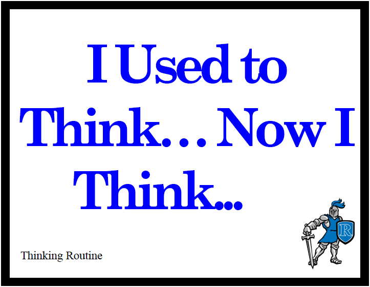

# Thinking Routine: 

I am genuinely interested in how your thinking has grown, deepened, shifted or changed. This thinking routine does NOT imply that what you thought before was wrong and now somehow it's right. There is no right or wrong way to think about Statistics. 

# Purpose: 

This routine helps students reflect on their thinking about a topic or issue, and explore how and why that thinking has changed. It is useful in consolidating new learning and identifying new understandings, opinions, and beliefs. In addition, it develops metacognitive skills, reasoning abilities, and the identification of cause-and-effect relationships. 

# Instructions

In your learning journal, write a few sentences about what you used to think about the Applied side of Statistics (before you started this class? before you started 315?).  Then write a few sentences about what you think about Statistics now. Start your responses with the phrase **I used to think.../Now I think...**.

